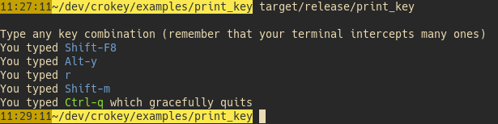

[![MIT][s2]][l2] [![Latest Version][s1]][l1] [![docs][s3]][l3] [![Chat on Miaou][s4]][l4]

[s1]: https://img.shields.io/crates/v/crokey.svg
[l1]: https://crates.io/crates/crokey

[s2]: https://img.shields.io/badge/license-MIT-blue.svg
[l2]: LICENSE

[s3]: https://docs.rs/crokey/badge.svg
[l3]: https://docs.rs/crokey/

[s4]: https://miaou.dystroy.org/static/shields/room.svg
[l4]: https://miaou.dystroy.org/3490?crokey

# Crokey

Crokey helps incorporate configurable keybindings in [crossterm](https://github.com/crossterm-rs/crossterm)
based terminal applications by providing functions
- parsing key combinations from strings
- describing key combinations in strings
- parsing key combinations at compile time
- combining Crossterm key events in key combinations

## The KeyCombination

A `KeyCombination` is made of 1 to 3 "normal" keys with some optional modifiers (alt, shift, ctrl).

It can be parsed, ergonomically built with the `key!` macro, obtained from key events.

## The Combiner

With a `Combiner`, you can change raw Crossterm key events into key combinations.

When the terminal is modern enough and supports the Kitty protocol, complex combinations with up to three non-modifier keys may be formed, for example `Ctrl-Alt-Shift-g-y` or `Space-i-u`.

For standard ANSI terminals, only regular combinations are available, like `Shift-o`, `Ctrl-Alt-Shift-g` or `i`.

The combiner works in both cases:
if you presses the `ctrl`, `i`, and `u ` keys at the same time, it will result in one combination (`ctrl-i-u`) on a kitty-compatible terminal, and as a sequence of 2 key combinations (`ctrl-i` then `ctrl-u` assuming you started pressing the `i` before the `u`) in other terminals.

The `print_key` example shows how to deal with that:

```rust
let fmt = KeyCombinationFormat::default();
let mut combiner = Combiner::default();
let combines = combiner.enable_combining().unwrap();
if combines {
    println!("Your terminal supports combining keys");
} else {
    println!("Your terminal doesn't support combining non-modifier keys");
}
println!("Type any key combination");
loop {
    terminal::enable_raw_mode().unwrap();
    let e = read();
    terminal::disable_raw_mode().unwrap();
    match e {
        Ok(Event::Key(key_event)) => {
            if let Some(key_combination) = combiner.transform(key_event) {
                match key_combination {
                    key!(ctrl-c) | key!(ctrl-q) => {
                        println!("quitting");
                        break;
                    }
                    _ => {
                        println!("You typed {}", fmt.to_string(key_combination));
                    }
                }
            }
        },
        ...
    }
}
```

## Parse a string

Those strings are usually provided by a configuration file.

```rust
use crossterm::event::{KeyCode, KeyEvent, KeyModifiers};
assert_eq!(
    crokey::parse("alt-enter").unwrap(),
    KeyEvent::new(KeyCode::Enter, KeyModifiers::ALT),
);
assert_eq!(
    crokey::parse("shift-F6").unwrap(),
    KeyEvent::new(KeyCode::F(6), KeyModifiers::SHIFT),
);
```

## Use key combination "literals" thanks to procedural macros

Those key combinations are parsed at compile time and have zero runtime cost.

They're efficient and convenient for matching events or defining hardcoded keybindings.

```rust
match key_event.into() {
    key!(ctrl-c) => {
        println!("Arg! You savagely killed me with a {}", fmt.to_string(key_event).red());
        break;
    }
    key!(ctrl-q) => {
        println!("You typed {} which gracefully quits", fmt.to_string(key_event).green());
        break;
    }
    _ => {
        println!("You typed {}", fmt.to_string(key_event).blue());
    }
}
```

Complete example in `/examples/print_key`:



The `key!` macro can be called in const contexts:

```rust
const quit: KeyCombination = key!(ctrl-q);
```

## Display a string with a configurable format

```rust
use crokey::*;
use crossterm::event::{KeyCode, KeyEvent, KeyModifiers};

// The default format
let format = KeyCombinationFormat::default();
assert_eq!(format.to_string(key!(shift-a)), "Shift-a");
assert_eq!(format.to_string(key!(ctrl-c)), "Ctrl-c");

// A more compact format
let format = KeyCombinationFormat::default()
    .with_implicit_shift()
    .with_control("^");
assert_eq!(format.to_string(key!(shift-a)), "A");
assert_eq!(format.to_string(key!(ctrl-c)), "^c");
```

## Deserialize keybindings using Serde

With the "serde" feature enabled, you can read configuration files in a direct way:

```
use {
    crokey::*,
    crossterm::event::KeyEvent,
    serde::Deserialize,
    std::collections::HashMap,
};
#[derive(Deserialize)]
struct Config {
    keybindings: HashMap<CroKey, String>,
}
static CONFIG_HJSON: &str = r#"
{
    keybindings: {
        a: aardvark
        shift-b: babirussa
        ctrl-k: koala
        alt-j: jaguar
    }
}
"#;
let config: Config = deser_hjson::from_str(CONFIG_HJSON).unwrap();
let key_event: KeyEvent = key!(shift-b);
assert_eq!(
    config.keybindings.get(&key_event.into()).unwrap(),
    "babirussa",
);
```

You can use any Serde compatible format such as JSON or TOML.

The `CroKey` wrapper type may be convenient as it implements `FromStr`,
`Deserialize`, and `Display`, but its use is optional. The "deser_keybindings" example
uses TOML and demonstrates how to have `KeyEvent` keys in the map instead of `Crokey`.

## Crossterm Compatibility

Crokey includes and reexports Crossterm, so you don't have to import it and to avoid conflicts.


[about Crossterm 0.25](https://github.com/Canop/crokey/issues/16)

